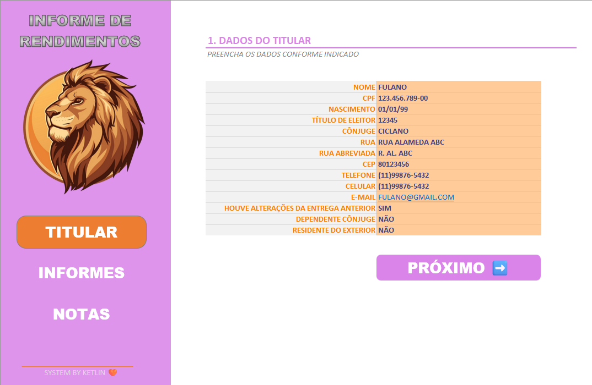
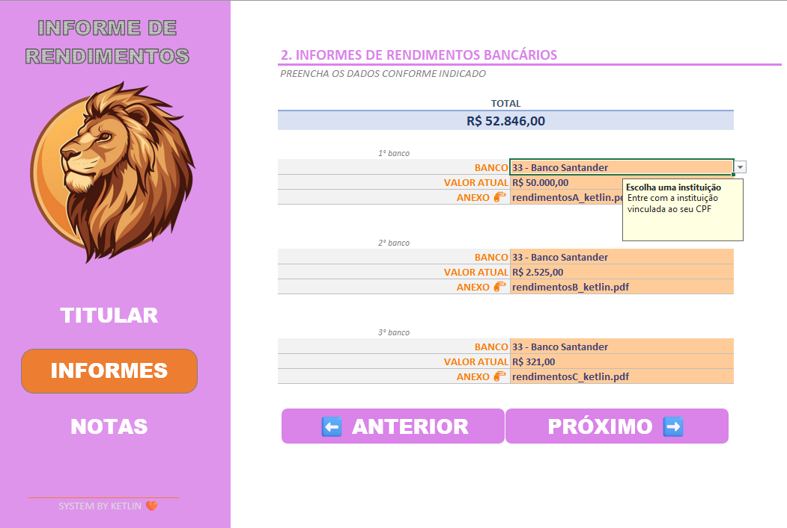
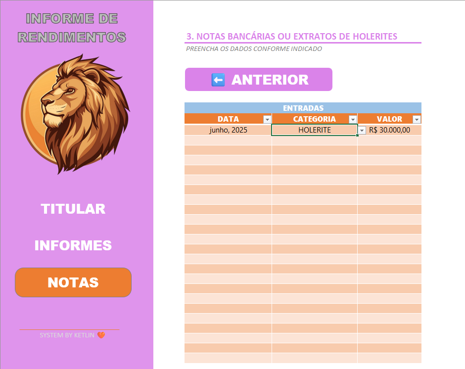

# 🧾 Organizador de Imposto de Renda

Esta planilha foi desenvolvida para facilitar a organização das informações necessárias para a declaração do Imposto de Renda. Com uma interface simples e intuitiva, ela permite reunir todos os dados relevantes em um só lugar, ajudando a evitar esquecimentos e a manter tudo sob controle.

## 📌 Funcionalidades

- **Informações Pessoais**: campos para preenchimento de dados do contribuinte, como CPF, endereço, dependentes, entre outros.
- **Informações Bancárias**: espaço para registrar contas bancárias, saldos, rendimentos e aplicações financeiras.
- **Notas e Documentos**: seção dedicada ao controle de notas fiscais, recibos e comprovantes importantes para a declaração.

## ✅ Como Usar

1. Abra a planilha no Excel ou software compatível.
2. Preencha os campos com suas informações pessoais e financeiras.
3. Utilize a seção de notas para anexar ou registrar documentos importantes.

## 📎 Requisitos

- Microsoft Excel 2016 ou superior
- Conhecimento básico sobre os documentos exigidos pela Receita Federal

## Telas da Ferramenta

## 📄 Licença

Este projeto está licenciado sob a Licença MIT.

## Autor

Desenvolvido por Ketlin Danieli de Lima.

---
> **Nota:** Esta planilha é uma ferramenta de apoio e não substitui a orientação de um contador ou especialista em contabilidade.
